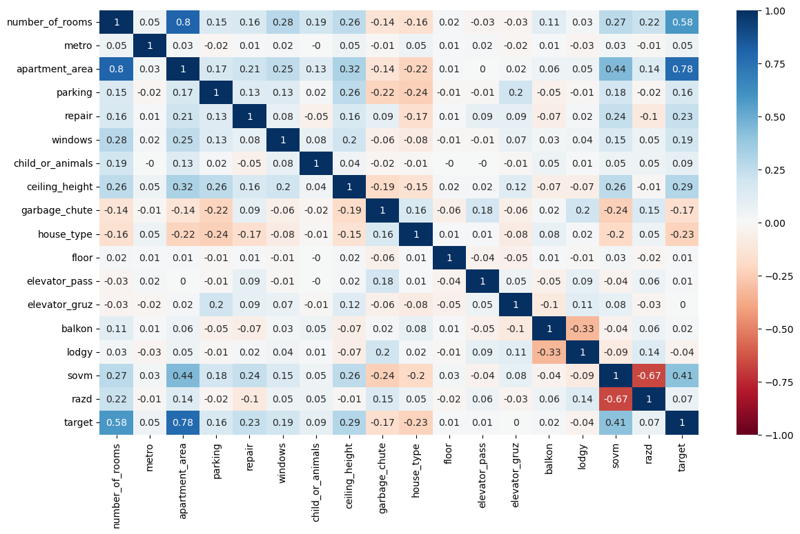
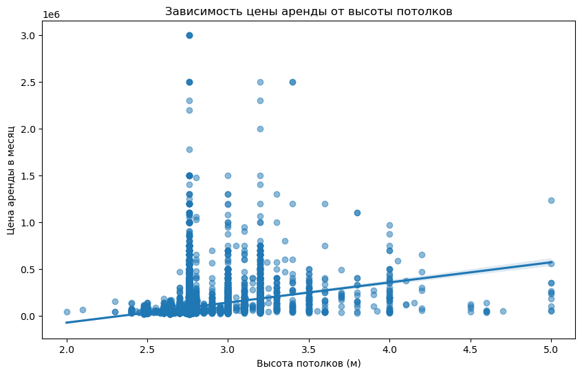

## Описание задач

Основная задача данного релиза - на очищенных, от пропущенных значений, данных сконструировать признаки (feature engineering).

Нами были предложены ряд признаков:
- Тип дома
- "Срединность" расположения квартиры в многоэтажном доме
- Грузовой и пассажирский лифты в доме
- Балкон в квартире и/или лоджия
- Совмещенный и/или раздельный санузел

Планируется реализовать следующие идеи:
- Добавить фичу с адресом
- Добавление фичи с округами и районами
- Более подробно посмотреть отброшенные данные из столбца Описание
- для точного и полного расчёта стоимости арендной платы в месяц, необходимо учесть коммунальные платежи, вытащить залог и по этому параметру отфильтровать предложения по рынку недвижимости

Ну, и немного графичков, наших результатов ;)

